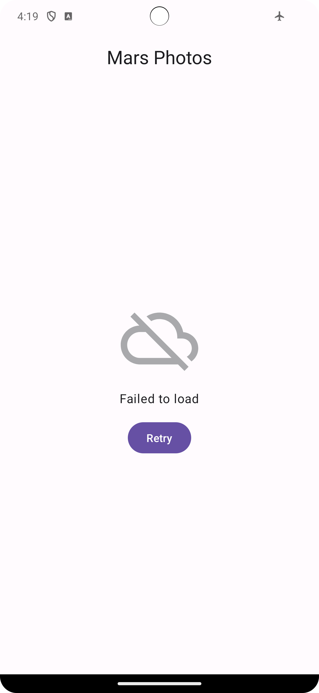

Mars Photos
==================================

Mars Photos app is a demo app that shows actual images of Mars' surface. These images are
real-life photos from Mars captured by NASA's Mars rovers. The data is stored on a Web server
as a REST web service.

This app demonstrated the use of [Retrofit](https://square.github.io/retrofit/) to make REST requests to the web service, [kotlinx.serialization](https://github.com/Kotlin/kotlinx.serialization) to
handle the deserialization of the returned JSON to Kotlin data objects, and [Coil](https://coil-kt.github.io/coil/) to load images by URL.

It's developed using Jetpack Compose components like ```Column```, ```Button```, ```Text```, ```Image```, and ```Modifier```.

<p align="center">
  
  
</p>

Getting Started
---------------

1. [Install Android Studio](https://developer.android.com/studio/install.html), if you don't already
   have it.
2. Download the sample.
3. Import the sample into Android Studio.
4. Build and run the sample.